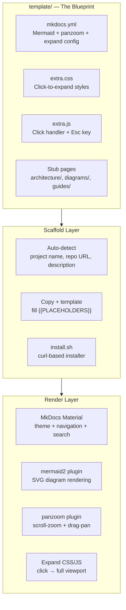
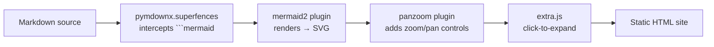

# Architecture Overview

autwicky is a template-driven system that scaffolds MkDocs Material wikis. It has three layers: template, scaffold, and render.

## System Components

## Three-Layer Design

| Layer | What | Where |
|-------|------|-------|
| **Template** | mkdocs.yml + assets + stubs | `template/docs/` |
| **Scaffold** | Detection + copy + placeholder fill | `install.sh` (local) or `scaffold.sh` (template) |
| **Render** | MkDocs + plugins at build time | `mkdocs build` |

## Plugin Stack

## Why MkDocs Material?

| Requirement | Solution |
|-------------|----------|
| Human-readable | Material theme, navigation, search |
| Mermaid diagrams | mermaid2 plugin with superfences integration |
| Zoomable diagrams | Panzoom plugin (native MkDocs plugin) |
| Expand to viewport | Custom CSS/JS (20 lines) |
| Dark/light mode | Material palette auto-detection |
| Code blocks | Syntax highlighting + copy button |
| Git-native | Markdown files versioned alongside code |
| LLM-friendly | Markdown is the easiest format for agents to generate |
