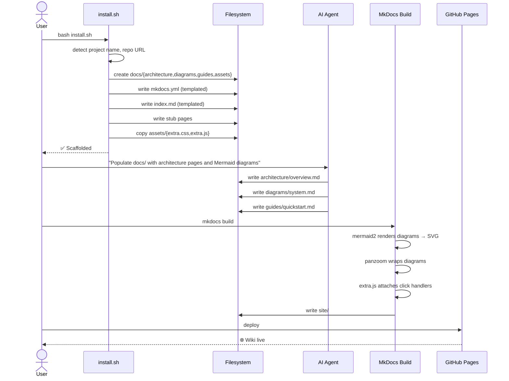

# System

## Scaffold → Content → Build Pipeline



## Mermaid Rendering Pipeline

```mermaid
flowchart LR
    subgraph Source
        MD["```mermaid<br/>C4Context<br/>  Person(...)<br/>```"]
    end

    subgraph "MkDocs Processing"
        SF["superfences<br/>intercepts mermaid blocks"]
        M2["mermaid2 plugin<br/>calls mermaid.initialize()"]
        CFG["Config applied<br/>rankSpacing, nodeSpacing,<br/>wrappingWidth, fontSize"]
    end

    subgraph "Browser"
        SVG["SVG rendered"]
        PZ["panzoom<br/>scroll-zoom + drag-pan"]
        EX["extra.js<br/>click → .expanded class"]
    end

    MD --> SF --> M2 --> CFG --> SVG --> PZ --> EX
```

## Feature Matrix

| Feature | Without autwicky | With autwicky |
|---------|-----------------|---------------|
| MkDocs setup | Read docs, write mkdocs.yml manually | `bash install.sh` |
| Mermaid diagrams | Configure superfences + plugin manually | Built into template |
| Zoom/pan | None (static SVGs) | Panzoom plugin |
| Expand to viewport | None (squint at small diagrams) | Click → fullscreen |
| Dark mode | Manual config | Auto-detected |
| Diagram defaults | Mermaid built-ins (tight spacing) | `rankSpacing: 60`, `nodeSpacing: 40` |
| Project-specific config | Manual | Auto-detected from git + README |
